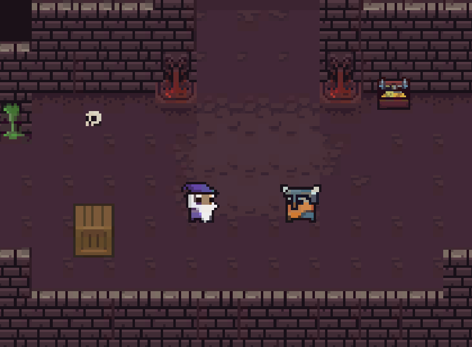
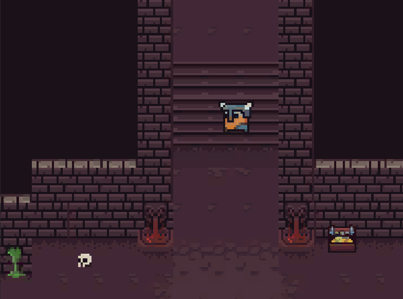

<h1>Pyramis Pulmentum</h1>

 

   
   
   
   
   

<h3 align="center">Our project is 2D dungeon game where you have to kill orcs and advance to new levels.<h3>
<h1></h1>
<h1>💻 About  </h1>

Varg - Who is the son of Loki and this is the main reason he is hated by all the gods who send him a number of monsters. After he burns 7 churches, is sent to the underworld where he fights orcs including the strongest of them all, Urukkai. Varg is gifted with enviable magical skills and is married to Kari Rueslåtten. The only one who is kind to Varg is Dumbal, who is a wizard sent by Odin to stretch Varg.

<h1>🎥 Demo of our project </h1>

  
  

<h1> 📥 Installing </h1>

 To install our project on your machine you just need to clone it. This can be done by : 

<pre>git clone "https://github.com/codingburgas/final-project-MZIlcheva19"</pre>
<h1>🐱‍💻 Our Team</h1>

Maria Ilcheva - <a href = "https://github.com/MZIlcheva19"> MZIlcheva19</a> - Scrum trainer

Vanina Teneva - <a href = "https://github.com/VNTeneva19"> VNTeneva19</a> - Scrum trainer

Simeon Redanski - <a href = "https://github.com/SERedanski20"> SERedanski20</a> - Back-end Developer 

Svetoslav Stoilov - <a href = "https://github.com/SDStoilov20"> SDStoilov20 </a> - Designer 

Iva Nedkova - <a href = "https://github.com/INNedkova21"> INNedkova21 </a> - Front-End Developer 

Atanas Atanasov - <a href = "https://github.com/ADAtanasov21"> ADAtanasov21 </a> - Front-End Developer 

Daniel Buzin - <a href = "https://github.com/DRBuzin21"> DRBuzin21 </a> - Front-End Developer 
